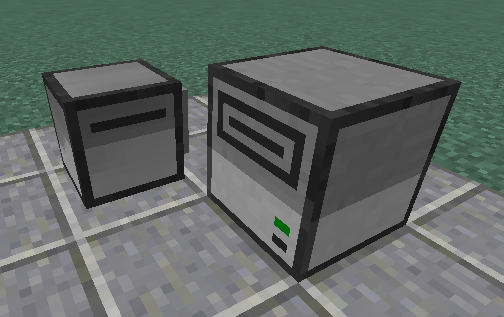

# ComputerCraft Scripts
This is a sideproject made with [ComputerCraft](https://computercraft.info/wiki/Main_Page), a Minecraft Mod that allows for lua to be used to program machines.

## diggingTeam
This program is a tool for managing mining turtles.

### Setup
You will need a master turtle with a wireless modem on it(just place it inside the inventory of the turtle. It will equip it automatically) and a printer. The printer will need a floppy disk in it. 

The Drone turles will need a pickaxe on the left side and a wireless modem on the right. Else it wont work

### Running all programs
[Video here](https://www.youtube.com/watch?v=yZJrTBDLBRM)
